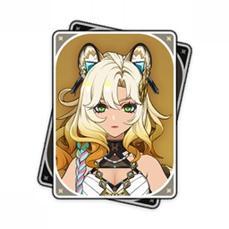

<table>
  <tr>
    <td width="160">
      
    </td>
    <td>
      

        A real big $${\color{yellow}Xilonen}$$ main someone could ever know of,
        This is my Xilonen ID! 
        I plan on making most of my repositories great with the geo element as such 🫠  
        For the innovation!
      

    </td>
  </tr>
</table>

 Hello! I am $${\color{yellow}tufbyte}$$, a Genshin Impact fan and a vibe coder who is interested in studying Data Science.
I am a Xilonen main in Genshin with $${\color{blue}AR 50}$$ right now and my favorite nation is $${\color{red}Natlan}$$ ofcourse!

